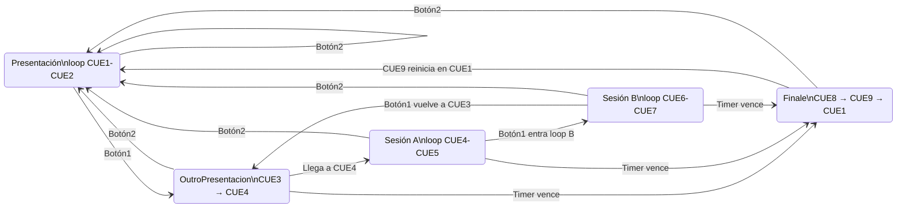

# video-player v2.1

Reproductor de video para **Raspberry Pi 5**: VLC con cuepoints configurables, timer de sesión y control por GPIO. Arranque automático con systemd. Pensado para kiosk con HDMI.

**Repositorio:** [github.com/sector7gp/video-player](https://github.com/sector7gp/video-player)

## Versión 2.1 — Resumen

| Elemento | Valor |
|----------|--------|
| Plataforma | Raspberry Pi 5, `lgpio` (chip 0) |
| Proyecto en la Pi | `/home/video1/video-player` |
| Video | `/media/video1.mp4` |
| Arranque | Loop presentación **CUE1 → CUE2** |
| Botón1 (GPIO23) | Desde presentación: **salta a CUE3** (outro) y continúa a CUE4; luego loop sesión A **CUE4 → CUE5** |
| Botón1 (2.ª pulsación) | En sesión A: loop sesión B **CUE6 → CUE7** |
| Timer | Al vencer → **CUE8**; al llegar a **CUE9** → reinicio en **CUE1** |
| Botón2 (GPIO24) | Siempre vuelve a **CUE1** (presentación) |
| Configuración | `config.json` (cuepoints + timer) |
| Audio | En `config.json` (`audio.salida`, `audio.alsa_*`) con override por env vars |
| Servicio | `video-control.service` → `multi-user.target` |

## Flujo de estados



## Características

- Reproducción en bucle del MP4 (`--input-repeat=-1` en instancia y medio).
- **Presentación al arrancar:** loop entre `cue1_ms` y `cue2_ms`.
- **Botón1 (GPIO23):** desde presentación inicia timer y salta a `CUE3` (outro). Al pasar `CUE4` entra a loop de sesión A (`CUE4–CUE5`).
- **Sesión B por botón1:** en sesión A, segunda pulsación (timer activo) → loop `CUE6–CUE7`; tercera pulsación sale del loop y vuelve a `CUE3`.
- **Timer:** al vencer salta a `CUE8`; al llegar a `CUE9` reinicia en `CUE1` (presentación).
- **Botón2 (GPIO24):** en cualquier momento seek a `cue1_ms` y cancela el timer.
- Antirebote hardware (50 ms) y software (400 ms entre pulsaciones).
- Log en `control.log`; metadatos del video vía ffprobe al arrancar.
- **Audio:** salida por **HDMI** o **placa externa** (USB/HAT) vía ALSA, configurable.

## Requisitos

- Raspberry Pi 5
- Raspberry Pi OS con VLC y Python 3
- HDMI conectado; MP4 en `/media/video1.mp4`
- Dos botones entre GPIO y **GND** (pull-up interno en firmware)

```bash
sudo apt update
sudo apt install -y vlc python3-vlc python3-lgpio ffmpeg git
sudo usermod -aG video,render,input,gpio video1
```

(Reiniciar sesión o la Pi tras `usermod`.)

## Instalación rápida

```bash
git clone https://github.com/sector7gp/video-player.git /home/video1/video-player
# Copiar o enlazar el video:
# sudo cp /ruta/origen.mp4 /media/video1.mp4

cd /home/video1/video-player
cp config.json.example config.json   # solo la primera vez; editar cuepoints locales
# Editar config.json con los tiempos de tu video (no se sobreescribe con git pull)
sudo bash deploy/install-service.sh video1
sudo reboot
```

## Cableado

| GPIO | Función |
|------|---------|
| **23** | Botón1 — sesión / escala loop |
| **24** | Botón2 — vuelve a CUE1 (presentación) |

Conexión: un lado del botón al GPIO, el otro a **GND**.

## Uso

### Manual

```bash
cd /home/video1/video-player
python3 video_control.py
```

### Botones

| Botón | Acción |
|-------|--------|
| GPIO23 (botón1) | En presentación: timer + loop CUE3–CUE4. En sesión A: entra loop CUE6–CUE7. En sesión B: sale del loop y vuelve a CUE3 |
| GPIO24 (botón2) | Siempre: vuelve a CUE1 y cancela timer |

### Servicio systemd

```bash
sudo systemctl status video-control.service
journalctl -u video-control.service -f
tail -f /home/video1/video-player/control.log
```

El unit (`deploy/video-control.service`) arranca sin escritorio: espera `/dev/dri/card0`, `WorkingDirectory` y script en `video-player/`.

## Configuración

### `config.json`

`config.json` **no está en el repositorio** (configuración local por instalación). Copiá la plantilla y editá los cuepoints:

```bash
cp config.json.example config.json
```

Plantilla (`config.json.example`):

| Campo | Descripción |
|-------|-------------|
| `video.path` | Archivo de video |
| `cuepoints.cue1_ms` | Inicio presentación (loop con CUE2) |
| `cuepoints.cue2_ms` | Fin presentación |
| `cuepoints.cue3_ms` | Inicio de outro de presentación (salto por botón1) |
| `cuepoints.cue4_ms` | Fin outro / inicio loop sesión A |
| `cuepoints.cue5_ms` | Fin loop sesión A / inicio loop sesión B |
| `cuepoints.cue6_ms` | Inicio loop sesión B |
| `cuepoints.cue7_ms` | Fin loop sesión B |
| `cuepoints.cue8_ms` | Salto al vencer el timer |
| `cuepoints.cue9_ms` | Reinicio a CUE1 al llegar aquí (post-timer) |
| `timer_minutos` | Duración del timer tras botón1 |
| `boton1_largo.segundos` | Umbral de pulsación larga para botón1 |
| `boton1_largo.salir_app_segundos` | Umbral de pulsación muy larga para cerrar la app |
| `boton1_largo.comando` | Comando a ejecutar en pulsación larga (recuperación) |
| `boton1_largo.overlay.texto` | Texto del overlay de pulsación larga |
| `boton1_largo.overlay.tamano` | Tamaño de fuente del overlay |
| `boton1_largo.overlay.centrado` | Centrado del overlay (`true/false`) |
| `boton1_largo.overlay.color_hex` | Color del texto (hex RGB) |
| `boton1_largo.overlay.opacidad` | Opacidad del texto (0-255) |
| `boton1_largo.overlay.sombra_roja` | Flag de intención visual (marquee no soporta sombra real) |
| `audio.salida` | `hdmi` o `externa` |
| `audio.alsa_hdmi` | Dispositivo ALSA HDMI |
| `audio.alsa_externa` | Dispositivo ALSA externo (USB/HAT) |

Los cuepoints deben ser **estrictamente crecientes**: CUE1 < CUE2 < … < CUE9.
Para pulsación larga, `boton1_largo.salir_app_segundos` debe ser mayor que `boton1_largo.segundos`.

`git pull` no modifica tu `config.json` local. El instalador crea `config.json` desde la plantilla si no existe.

Ruta alternativa del archivo: variable de entorno `CONFIG_PATH`.

Tras cambios en `config.json`: `sudo systemctl restart video-control.service`.

### Logs al arranque

Al iniciar el servicio, `control.log` y journalctl muestran la config cargada y las especificaciones del video:

```
INFO - Config cargada: video=/media/video1.mp4 | CUE1=20 CUE2=12000 ... | timer=5 min
INFO - Iniciando reproducción (presentación CUE1-CUE2)...
INFO - Video: /media/video1.mp4
INFO - Duración: 22356 ms (0:22) [ffprobe]
```

### Audio (config + override env vars)

Por defecto, el script toma audio desde `config.json`:

- `audio.salida`
- `audio.alsa_hdmi`
- `audio.alsa_externa`

Si definís variables de entorno en systemd, tienen prioridad sobre config:

| Variable | Default | Descripción |
|----------|---------|-------------|
| `AUDIO_SALIDA` | `hdmi` | `hdmi` o `externa` |
| `ALSA_HDMI` | `plughw:CARD=vc4hdmi0,DEV=0` | Dispositivo ALSA para HDMI |
| `ALSA_EXTERNA` | `plughw:CARD=Device,DEV=0` | Dispositivo ALSA para placa externa |

## Audio (HDMI o placa externa)

Por defecto el sonido sale por **HDMI** (`AUDIO_SALIDA = "hdmi"`).

### Usar placa de audio externa

1. Conectá la placa (USB o HAT) y listá dispositivos:

```bash
aplay -l
```

2. Probá el dispositivo (ej. tarjeta 1):

```bash
speaker-test -D plughw:1,0 -c2 -t wav
```

3. En `video_control.py`:

```python
AUDIO_SALIDA = "externa"
ALSA_EXTERNA = "plughw:1,0"   # ajustar según aplay -l
```

O con variables de entorno (sin editar el script), en el servicio systemd:

```ini
Environment=AUDIO_SALIDA=externa
Environment=ALSA_EXTERNA=plughw:1,0
```

4. Reiniciá el servicio:

```bash
sudo systemctl restart video-control.service
```

En `control.log` debe aparecer: `Audio: placa externa (plughw:1,0)`.

Si HDMI no suena en Pi 5, probá otro nombre de tarjeta, p. ej. `plughw:CARD=vc4hdmi1,DEV=0` en `ALSA_HDMI`.

### Pérdida intermitente de audio USB (bug conocido + fix replicable)

En algunas instalaciones con placa USB (por ejemplo, **VENTION CDKHB**), puede pasar que el video siga reproduciendo pero el audio se corte. Reiniciar `video-control.service` suele recuperar el sonido temporalmente.

**Síntomas típicos**

- El audio desaparece de forma aleatoria, sin detener el video.
- En logs de VLC/ALSA aparece: `cannot recover playback stream: No such device`.
- Reiniciar la app devuelve audio, pero el problema vuelve con el tiempo.

**Evidencia de causa raíz (dmesg)**

En `dmesg` se observan eventos de reconexión física/lógica del USB, por ejemplo:

- `usb usb3-port2: disabled by hub (EMI?), re-enabling...`
- `USB disconnect, device number ...`

Esto apunta a que el dispositivo USB de audio se está deshabilitando/reinicializando por gestión de energía, ruido eléctrico (EMI) o estabilidad de alimentación/bus USB.

**Mitigación software 1: desactivar autosuspend global USB**

1. Editar `/boot/firmware/cmdline.txt` (una sola línea) y agregar:

```bash
usbcore.autosuspend=-1
```

2. Reiniciar:

```bash
sudo reboot
```

**Mitigación software 2: forzar power/control=on por udev**

1. Obtener vendor y product del dispositivo USB de audio:

```bash
lsusb
```

2. Crear la regla udev (ejemplo para `0d8c:0014`):

```bash
sudo tee /etc/udev/rules.d/99-usb-audio-power.rules >/dev/null <<'EOF'
ACTION=="add", SUBSYSTEM=="usb", ATTR{idVendor}=="0d8c", ATTR{idProduct}=="0014", TEST=="power/control", ATTR{power/control}="on"
EOF
```

3. Recargar reglas y aplicar:

```bash
sudo udevadm control --reload-rules
sudo udevadm trigger
```

4. Verificar:

```bash
cat /sys/bus/usb/devices/*/power/control
```

**Nota sobre `snd_usb_audio`**

En este kernel de Raspberry Pi puede no existir el parámetro `power_save` para `snd_usb_audio` (por eso no se puede resolver desde `/sys/module/snd_usb_audio/parameters/power_save`). En este caso, usar las mitigaciones anteriores (`usbcore.autosuspend=-1` + regla `udev`) es el camino recomendado.

## Cómo funcionan los loops

- **Presentación:** al arrancar, loop `CUE1 → CUE2` hasta que se pulse botón1.
- **Outro presentación:** botón1 en presentación → seek a `CUE3`; el video continúa libre hasta `CUE4`.
- **Sesión A:** desde `CUE4`, loop `CUE4 → CUE5` mientras el timer siga activo.
- **Sesión B:** segunda pulsación de botón1 (con timer activo) → loop `CUE6 → CUE7`. Tercera pulsación → vuelve a `CUE3`.
- **Finale:** timer vencido → seek a `CUE8`; al llegar a `CUE9` → reinicio en `CUE1` (presentación).
- **Botón2:** seek a `CUE1`, cancela timer, modo presentación.
- **Pulsación larga de botón1:** si se mantiene más de `boton1_largo.segundos`, ejecuta `boton1_largo.comando`.
- **Pulsación muy larga de botón1:** si se mantiene más de `boton1_largo.salir_app_segundos`, cierra la app.
- **Overlay de confirmación:** al superar `boton1_largo.segundos` se muestra el texto de `boton1_largo.overlay.texto`, centrado y con tamaño configurable; al soltar se oculta.

## Estructura del repositorio

```
video-player/
├── video_control.py      # Programa principal (v2.0)
├── config.json.example   # Plantilla de cuepoints + timer
├── config.json           # Local (gitignore); copiar desde .example
├── VERSION               # 2.1.1
├── README.md
└── deploy/
    ├── video-control.service
    └── install-service.sh
```

## Notas

- MP4 **H.264** o **H.265**; 4K exige buena refrigeración y alimentación en Pi 5.
- Si usás **X11** (`DISPLAY=:0`), adaptá el `.service` localmente; la v1.0 por defecto es headless/DRM.

## Changelog

### v2.1.1 (2026-06-28)

- Sección A y sección B ahora usan extremos independientes (sin compartir cuepoints).
- Renumeración: sesión A `CUE4–CUE5`, sesión B `CUE6–CUE7`, timer `CUE8`, reinicio en `CUE9`.

### v2.1.0 (2026-06-28)

- Nuevo cuepoint de outro de presentación (`CUE3`) entre loop de presentación y sesión.
- Botón1 en presentación ahora salta a `CUE3` y el video continúa hasta `CUE4`.
- Renumeración completa de cuepoints: sesión A `CUE4–CUE5`, sesión B `CUE5–CUE6`, timer `CUE7`, reinicio en `CUE8`.

### v2.0.6 (2026-06-26)

- Pulsación larga de botón1 muestra overlay en pantalla (`SOLTAR PARA / REINICIAR`) al cumplir el umbral y lo oculta al soltar.

### v2.0.8 (2026-06-26)

- Fix de compatibilidad marquee: si `Position/Color/Opacity` no están soportados por la build de VLC, el overlay sigue mostrando texto (degradación elegante).

### v2.0.7 (2026-06-26)

- Overlay configurable desde `config.json`: texto, tamaño, centrado, color y opacidad.
- El overlay se muestra centrado (`boton1_largo.overlay.centrado=true`) por defecto.
- Nota: VLC marquee no soporta fondo/sombra real; `sombra_roja` se registra como intención visual.

### v2.0.5 (2026-06-26)

- Botón1 con pulsación larga configurable: ejecuta `boton1_largo.comando` al superar `boton1_largo.segundos`.

### v2.0.4 (2026-06-26)

- Audio centralizado en `config.json` (`audio.salida`, `audio.alsa_hdmi`, `audio.alsa_externa`).
- Variables de entorno siguen disponibles como override (`AUDIO_SALIDA`, `ALSA_HDMI`, `ALSA_EXTERNA`).

### v2.0.3 (2026-06-09)

- Fix: loop CUE3–CUE4 (y CUE4–CUE5) con timer activo; seek ya no bloquea el loop al restaurar posición.

### v2.0.2 (2026-06-09)

- Timer vencido: salta a CUE6; al llegar a CUE7 reinicia en CUE1 (nuevo `cue7_ms`).

### v2.0.1 (2026-06-09)

- Botón1 en loop CUE4–CUE5: toggle off restaura la posición guardada (como el loop corto anterior).
- `config.json` ignorado por git; plantilla en `config.json.example` para configuración local.

### v2.0.0 (2026-06-09)

- Sistema de cuepoints CUE1–CUE6 con presentación, sesión con timer, loops escalonados y finale.
- Botón1 (GPIO23): inicia sesión / escala a loop CUE4–CUE5.
- Botón2 (GPIO24): siempre vuelve a CUE1.
- `config.json`: reemplaza `loop_corto` y `loop_principal` por `cuepoints` + `timer_minutos`.

### v1.3.4 (2026-06-09)

- Fix: eliminado parse/tracks VLC que causaba segmentation fault en Pi; metadatos vía ffprobe o reproductor.

### v1.3.3 (2026-06-09)

- Fix: lectura de pistas VLC compatible con python-vlc de Raspberry Pi (`track.video` sin `.u`).

### v1.3.2 (2026-06-09)

- Fix: metadatos en hilo aparte; ya no se parsea el media activo (evita que el video no arranque).

### v1.3.1 (2026-06-09)

- Fix: metadatos del video al arranque (parse `fetch_local`, lectura tras `play()`, fallback ffprobe).

### v1.3.0 (2026-06-09)

- Configuración en `config.json`: ruta del video, loop corto y loop principal.
- Al arrancar, log de duración y especificaciones del video (codec, resolución, fps, audio).
- Variable de entorno `CONFIG_PATH` para ruta alternativa del JSON.

### v1.2.0 (2026-06-04)

- Audio configurable: `AUDIO_SALIDA` = `hdmi` o `externa` (ALSA en VLC).
- Variables `ALSA_HDMI` / `ALSA_EXTERNA` y ejemplos en el servicio systemd.

### v1.1.0 (2026-06-04)

- Eliminado `player.py` (referencia obsoleta; solo `video_control.py`).
- **Loop principal anticipado:** `REINICIO_LOOP_MS` reinicia en `RESTART_MS` antes del final del MP4 (evita pantalla negra del buffer).
- Modo automático: `REINICIO_LOOP_MS = 0` usa `duración − MARGEN_ANTES_FIN_MS`.
- Respaldo si VLC llega igual a `Ended` (umbral mal configurado).

### v1.0.0 (2026-06-04)

Primera versión estable.

- GPIO23: loop corto por toggle con posición guardada.
- GPIO24: reinicio rápido a 20 ms.
- Reinicio automático al fin del video (estado `Ended`).
- Rutas: proyecto en `/home/video1/video-player`, video en `/media/video1.mp4`.
- Servicio systemd e instalador `deploy/install-service.sh`.
- Logging a `control.log`.

## Licencia

Uso libre para el proyecto del autor; sin garantía.
